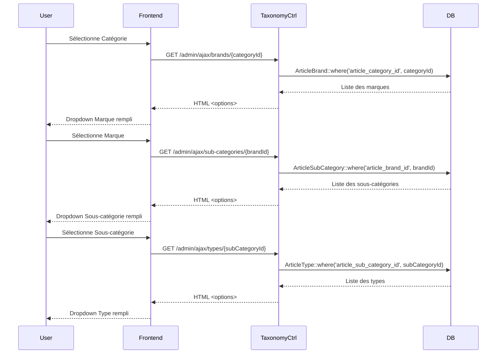

# Stock R4E - Architecture du Projet

## 📊 Diagramme des Relations de la Base de Données

```mermaid
erDiagram
    ArticleCategory ||--o{ ArticleBrand : "has many"
    ArticleBrand ||--o{ ArticleSubCategory : "has many"
    ArticleSubCategory ||--o{ ArticleType : "has many"
    
    ArticleCategory {
        int id PK
        string name
        timestamps
    }
    
    ArticleBrand {
        int id PK
        int article_category_id FK
        string name
        timestamps
    }
    
    ArticleSubCategory {
        int id PK
        int article_category_id FK
        int article_brand_id FK
        string name
        timestamps
    }
    
    ArticleType {
        int id PK
        int article_sub_category_id FK
        string name
        timestamps
    }
    
    Console ||--o| ArticleCategory : "belongs to"
    Console ||--o| ArticleBrand : "via subCategory"
    Console ||--o| ArticleSubCategory : "belongs to"
    Console ||--o| ArticleType : "belongs to"
    Console ||--o| Store : "belongs to"
    Console ||--o| Repairer : "belongs to"
    Console ||--o| Invoice : "belongs to"
    Console ||--o| ProductSheet : "belongs to"
    Console }o--o{ Mod : "many to many"
    Console }o--o{ Store : "prices (many to many)"
    Console ||--o{ ConsoleReturn : "has many"
    Console ||--o{ RepairQuote : "has many"
    Console ||--o{ ConsoleOffer : "has many"
    
    Console {
        int id PK
        int article_category_id FK
        int article_sub_category_id FK
        int article_type_id FK
        int store_id FK
        int repairer_id FK
        int invoice_id FK
        int product_sheet_id FK
        string serial_number
        string status
        decimal prix_achat
        decimal price
        text provenance_article
        text lieu_stockage
        timestamps
    }
    
    Store ||--o{ Console : "has many"
    Store ||--o{ Invoice : "has many"
    Store ||--o| User : "has one"
    
    Store {
        int id PK
        string name
        string address
        timestamps
    }
    
    Repairer ||--o{ Console : "has many"
    Repairer }o--o{ Operation : "skills (many to many)"
    
    Repairer {
        int id PK
        string name
        string email
        boolean is_active
        timestamps
        softDeletes
    }
    
    Mod {
        int id PK
        string name
        decimal purchase_price
        boolean is_accessory
        boolean is_operation
        string icon
        timestamps
    }
    
    Operation {
        int id PK
        string name
        text description
        timestamps
    }
    
    Accessory {
        int id PK
        string name
        decimal purchase_price
        int stock_quantity
        timestamps
    }
    
    ProductSheet ||--o| ArticleType : "belongs to"
    
    ProductSheet {
        int id PK
        int article_type_id FK
        string name
        int release_year
        text description
        text technical_specs
        json images
        json condition_criteria
        json featured_mods
        timestamps
    }
    
    ConsoleReturn ||--o| Console : "belongs to"
    ConsoleReturn ||--o| Store : "belongs to"
    
    ConsoleReturn {
        int id PK
        int console_id FK
        int store_id FK
        string reason
        string status
        timestamps
    }
    
    RepairQuote ||--o| Console : "belongs to"
    RepairQuote ||--o| ConsoleReturn : "belongs to"
    
    RepairQuote {
        int id PK
        int console_id FK
        int console_return_id FK
        decimal amount
        text description
        string status
        timestamps
    }
    
    Invoice {
        int id PK
        int store_id FK
        decimal total_amount
        date invoice_date
        timestamps
    }
    
    ConsoleOffer ||--o| Console : "belongs to"
    ConsoleOffer ||--o| Store : "belongs to"
    
    ConsoleOffer {
        int id PK
        int console_id FK
        int store_id FK
        decimal sale_price
        decimal consignment_price
        string status
        timestamps
    }
    
    FeatureRequest {
        int id PK
        int user_id FK
        string type
        string title
        text description
        string status
        string priority
        json responses
        timestamps
    }
```

## 🏗️ Structure des Contrôleurs

```mermaid
graph TB
    subgraph "Admin Controllers"
        AdminDashboard[DashboardController]
        ConsoleAdmin[ConsoleAdminController]
        StoreAdmin[StoreAdminController]
        TaxonomyCtrl[TaxonomyController]
        ProductSheetCtrl[ProductSheetController]
        RepairerAdmin[RepairerAdminController]
        ModAdmin[ModAdminController]
        OperationAdmin[OperationAdminController]
        AccessoryAdmin[AccessoryAdminController]
        ConsoleReturn[ConsoleReturnController]
        RepairQuoteAdmin[RepairQuoteAdminController]
        ConsoleOffer[ConsoleOfferController]
        FeatureRequestCtrl[FeatureRequestController]
        GameBoyImport[GameBoyImportController]
    end
    
    subgraph "Store Controllers"
        StoreDashboard[DashboardController]
        StoreOffer[StoreOfferController]
    end
    
    subgraph "Repairer Controllers"
        RepairerConsole[RepairerConsoleController]
    end
    
    AdminDashboard --> Console
    ConsoleAdmin --> Console
    ConsoleAdmin --> ArticleCategory
    ConsoleAdmin --> ArticleType
    ConsoleAdmin --> Store
    ConsoleAdmin --> Repairer
    ConsoleAdmin --> ProductSheet
    
    TaxonomyCtrl --> ArticleCategory
    TaxonomyCtrl --> ArticleBrand
    TaxonomyCtrl --> ArticleSubCategory
    TaxonomyCtrl --> ArticleType
    
    ProductSheetCtrl --> ProductSheet
    ProductSheetCtrl --> ArticleType
    
    RepairerAdmin --> Repairer
    RepairerAdmin --> Operation
    
    ModAdmin --> Mod
    OperationAdmin --> Operation
    AccessoryAdmin --> Accessory
```



## 📁 Structure des Vues (Blade Templates)

```
resources/views/
│
├── layouts/
│   └── app.blade.php                    # Layout principal
│
├── auth/                                # Vues d'authentification (Breeze)
│   ├── login.blade.php
│   ├── register.blade.php
│   └── forgot-password.blade.php
│
├── admin/
│   ├── dashboard.blade.php              # Tableau de bord admin
│   │
│   ├── consoles/
│   │   ├── index.blade.php             # Liste stock avec filtres (Cat > Marque > Sous-cat > Type)
│   │   ├── form.blade.php              # Formulaire création/édition article
│   │   ├── edit.blade.php              # Édition prix console
│   │   ├── edit_full.blade.php         # Édition complète avec mods
│   │   ├── recent.blade.php            # 40 derniers articles
│   │   └── disabled.blade.php          # Consoles désactivées
│   │
│   ├── taxonomy/
│   │   └── index.blade.php             # Gestion taxonomie (CRUD Cat/Marque/Sous-cat/Type)
│   │
│   ├── product-sheets/
│   │   ├── index.blade.php             # Liste fiches produits
│   │   ├── create.blade.php            # Création fiche (avec ROM lookup)
│   │   ├── edit.blade.php              # Édition fiche
│   │   └── images-manager.blade.php    # Gestionnaire images taxonomie
│   │
│   ├── stores/
│   │   ├── index.blade.php             # Liste magasins
│   │   ├── create.blade.php            # Création magasin
│   │   ├── edit.blade.php              # Édition magasin
│   │   └── stock.blade.php             # Stock par magasin
│   │
│   ├── repairers/
│   │   ├── index.blade.php             # Liste réparateurs
│   │   ├── create.blade.php            # Création réparateur
│   │   ├── edit.blade.php              # Édition réparateur
│   │   └── show.blade.php              # Détails réparateur
│   │
│   ├── mods/
│   │   ├── index.blade.php             # Liste mods/accessoires
│   │   ├── create.blade.php
│   │   ├── edit.blade.php
│   │   └── distribute.blade.php        # Distribution aux réparateurs
│   │
│   ├── operations/
│   │   ├── index.blade.php             # Liste opérations
│   │   ├── create.blade.php
│   │   └── edit.blade.php
│   │
│   ├── accessories/
│   │   ├── index.blade.php             # Liste accessoires
│   │   ├── create.blade.php
│   │   ├── edit.blade.php
│   │   └── report.blade.php            # Rapport stock/valorisation
│   │
│   ├── returns/
│   │   └── index.blade.php             # Gestion retours SAV
│   │
│   ├── lot-requests/
│   │   └── index.blade.php             # Demandes de lots
│   │
│   └── feature-requests/
│       └── index.blade.php             # Bugs & demandes d'évolution
│
├── store/
│   ├── dashboard.blade.php              # Dashboard magasin
│   ├── product-sheet.blade.php          # Fiche produit détaillée
│   ├── sales.blade.php                  # Historique ventes
│   ├── external-repair-create.blade.php # Création réparation externe
│   └── offers/
│       └── index.blade.php             # Offres de consoles
│
└── repairer/
    ├── dashboard.blade.php              # Dashboard réparateur
    ├── consoles/
    │   ├── index.blade.php             # Consoles assignées
    │   └── edit-mods.blade.php         # Édition mods/accessoires
    └── skills.blade.php                # Gestion compétences
```

## 🔄 Flux de Données (Routes Principales)

```mermaid
graph LR
    subgraph "Admin Routes"
        A1[/admin/dashboard] --> AdminDashboard
        A2[/admin/articles/create] --> ConsoleAdmin.createArticle
        A3[/admin/articles/recent] --> ConsoleAdmin.recentArticles
        A4[/admin/consoles] --> ConsoleAdmin.index
        A5[/admin/taxonomy] --> TaxonomyCtrl.index
        A6[/admin/product-sheets] --> ProductSheetCtrl.index
        A7[/admin/repairers] --> RepairerAdmin.index
        A8[/admin/mods] --> ModAdmin.index
        A9[/admin/operations] --> OperationAdmin.index
        A10[/admin/accessories] --> AccessoryAdmin.index
    end
    
    subgraph "Store Routes"
        S1[/store/dashboard/:id] --> StoreDashboard.index
        S2[/store/product/:store/:console] --> StoreDashboard.productSheet
        S3[/store/offers] --> StoreOffer.index
        S4[/store/:store/sales] --> StoreDashboard.sales
    end
    
    subgraph "Repairer Routes"
        R1[/repairer/dashboard] --> RepairerConsole.dashboard
        R2[/repairer/consoles] --> RepairerConsole.index
        R3[/repairer/consoles/:id/mods] --> RepairerConsole.editMods
    end
```

## 🔌 Routes AJAX (Cascade Taxonomie)



## 📦 Modèles et Relations

### Console (Modèle Principal)
```php
// Relations
belongsTo(ArticleCategory)
belongsTo(ArticleSubCategory)
belongsTo(ArticleType)
belongsTo(Store)
belongsTo(Repairer)
belongsTo(Invoice)
belongsTo(ProductSheet)
belongsToMany(Store) via console_store_prices (withPivot: sale_price)
belongsToMany(Mod) via console_mod (withPivot: price_applied, work_time_minutes, notes)
hasMany(ConsoleReturn)
hasMany(RepairQuote)
hasMany(ConsoleOffer)

// Scopes
stock()          // where('status', 'stock')
defective()      // where('status', 'defective')
sold()           // where('status', 'vendue')
disabled()       // where('status', 'disabled')

// Accessors
getCoutRevientAttribute()      // Coût de revient total
getCoutReparationAttribute()   // Coût réparation (mods + main d'œuvre)
```

### ArticleCategory
```php
hasMany(ArticleBrand)
hasMany(ArticleSubCategory)
hasMany(Console)
```

### ArticleBrand
```php
belongsTo(ArticleCategory)
hasMany(ArticleSubCategory)
```

### ArticleSubCategory
```php
belongsTo(ArticleCategory)
belongsTo(ArticleBrand)
hasMany(ArticleType)
hasMany(Console)
```

### ArticleType
```php
belongsTo(ArticleSubCategory)
hasMany(Console)
hasMany(ProductSheet)
```

### Store
```php
hasOne(User)
hasMany(Console)
hasMany(Invoice)
hasMany(ConsoleReturn)
belongsToMany(Console) via console_store_prices
```

### Repairer
```php
hasMany(Console)
belongsToMany(Operation) via operation_repairer (skills)

// Traits
SoftDeletes
```

### ProductSheet
```php
belongsTo(ArticleType)

// Casts
images => array
condition_criteria => array
featured_mods => array
tags => array
```

## 🎯 Fonctions Clés par Contrôleur

### ConsoleAdminController
- `index()` - Liste stock avec filtres (category, brand, sub_category, type, status, store)
- `createArticle()` - Formulaire création
- `storeArticle()` - Sauvegarde article
- `editArticle()` - Édition rapide
- `editArticleFull()` - Édition complète avec mods
- `updateArticle()` - Mise à jour
- `recentArticles()` - 40 derniers articles
- `valorize()` - Formulaire valorisation
- `storeValorization()` - Sauvegarde valorisation
- `updateStatus()` - Changement statut
- `updateValorisation()` - Mise à jour valorisation
- `removeMod()` - Retirer un mod
- `destroyArticle()` - Suppression

### TaxonomyController
- `index()` - Vue CRUD taxonomie complète
- `storeCategory()` - Création catégorie
- `storeBrand()` - Création marque
- `storeSubCategory()` - Création sous-catégorie (récupère category via brand)
- `storeType()` - Création type
- `updateCategory()` - MAJ catégorie
- `updateBrand()` - MAJ marque
- `updateSubCategory()` - MAJ sous-catégorie
- `updateType()` - MAJ type
- `destroyCategory()` - Suppression catégorie (vérifie brands et subCategories)
- `destroyBrand()` - Suppression marque
- `destroySubCategory()` - Suppression sous-catégorie
- `destroyType()` - Suppression type
- `ajaxBrands($categoryId)` - AJAX: marques par catégorie
- `ajaxSubCategories($brandId)` - AJAX: sous-catégories par marque
- `ajaxTypes($subCategoryId)` - AJAX: types par sous-catégorie

### ProductSheetController
- `index()` - Liste fiches produits
- `create()` - Formulaire création
- `store()` - Sauvegarde fiche
- `edit()` - Formulaire édition
- `update()` - MAJ fiche
- `destroy()` - Suppression
- `uploadImage()` - Upload image locale
- `uploadFromUrl()` - Upload image depuis URL
- `deleteImage()` - Suppression image
- `autocompleteRomId()` - Autocomplete Game Boy ROM
- `lookupRomId()` - Recherche ROM dans API
- `getTaxonomyImages()` - Images par article_type_id
- `duplicate()` - Duplication fiche
- `imagesManager()` - Gestionnaire images taxonomie
- `uploadTaxonomyImage()` - Upload image taxonomie
- `deleteTaxonomyImage()` - Suppression image taxonomie

### RepairerAdminController
- `index()` - Liste réparateurs
- `create()` - Formulaire création
- `store()` - Sauvegarde réparateur
- `show()` - Détails réparateur
- `edit()` - Formulaire édition
- `update()` - MAJ réparateur
- `destroy()` - Suppression (soft delete)
- `updateOperations()` - MAJ compétences

### ModAdminController
- `index()` - Liste mods/accessoires
- `create()` - Formulaire création
- `store()` - Sauvegarde
- `edit()` - Formulaire édition
- `update()` - MAJ
- `destroy()` - Suppression
- `receiveStock()` - Réception stock
- `distribute()` - Vue distribution
- `sendToRepairer()` - Envoi à réparateur
- `deleteIcon()` - Suppression icône

### StoreDashboardController
- `index()` - Dashboard magasin
- `productSheet()` - Affichage fiche produit
- `sell()` - Vendre console
- `defective()` - Marquer défectueuse
- `cancelReturn()` - Annuler retour
- `requestRepairQuote()` - Demander devis réparation
- `sendToRepairer()` - Envoyer au réparateur
- `acceptRepairQuote()` - Accepter devis
- `rejectRepairQuote()` - Refuser devis
- `sales()` - Historique ventes
- `createExternalRepair()` - Formulaire réparation externe
- `storeExternalRepair()` - Sauvegarde réparation externe

### RepairerConsoleController
- `dashboard()` - Dashboard réparateur
- `updateSkills()` - MAJ compétences
- `index()` - Consoles assignées
- `editMods()` - Édition mods
- `updateMods()` - MAJ mods
- `addMod()` - Ajout mod rapide
- `removeMod()` - Retrait mod
- `markFunctional()` - Marquer fonctionnelle
- `acceptAssignment()` - Accepter affectation
- `confirmReceipt()` - Confirmer réception
- `confirmShipment()` - Confirmer expédition
- `markForRepair()` - Repasser en réparation

## 🔐 Middlewares

- `auth` - Authentification requise
- `AdminMiddleware` - Rôle admin requis
- `repairer` - Rôle réparateur requis

## 📊 Factories (Tests/Seeding)

- `ConsoleFactory` - Auto-crée Invoice si status = 'vendue'
- `StoreFactory`
- `RepairerFactory`
- `ArticleCategoryFactory`
- `ArticleBrandFactory`
- `ArticleSubCategoryFactory`
- `ArticleTypeFactory`
- `ModFactory`
- `OperationFactory`
- `AccessoryFactory`

## 🎨 Assets Frontend

### JavaScript (Alpine.js 3.4)
- Dropdown cascades taxonomie
- Modals dynamiques
- Filtres en temps réel
- Upload images

### CSS (Tailwind CSS 4)
- Theme dark adaptatif
- Composants réutilisables
- Grid responsive

### Vite Config
```javascript
// resources/css/app.css
// resources/js/app.js
// → public/build/
```

## 📝 Notes Techniques

### Cascade Taxonomie
**Hiérarchie** : Catégorie → Marque → Sous-catégorie → Type

**Implémentation** :
1. Sélection catégorie → charge marques via AJAX
2. Sélection marque → charge sous-catégories via AJAX
3. Sélection sous-catégorie → charge types via AJAX

### Gestion Mods/Réparations
- Pivot `console_mod` : price_applied, work_time_minutes, notes
- Calcul coût réparation : somme(mods.purchase_price) + (work_time_minutes / 60 * 20€)
- Distinction : is_operation (temps uniquement), is_accessory (accessoires)

### Upload Images
- Local : Cloudinary (10MB max)
- Taxonomie : storage/app/public/taxonomy-images/{category_id}/{brand_id}/{filename}
- Fiches produits : multiple images JSON

### Statuts Console
- `stock` - En stock
- `defective` - Défectueuse
- `vendue` - Vendue
- `disabled` - Désactivée
- `repair` - En réparation

### Game Boy ROM Lookup
- API externe pour autocomplete ROM IDs
- Pattern : DMG-[A-Z0-9]+-[0-9]
- Récupération auto : nom, année, infos

## 🚀 Commandes Artisan Importantes

```bash
php artisan migrate              # Migrations
php artisan db:seed             # Seeding
php artisan tinker              # REPL
php artisan view:clear          # Vider cache vues
php artisan cache:clear         # Vider cache
php artisan route:list          # Liste routes
```

## 📦 Packages Clés

- Laravel 12.43.1
- Laravel Breeze (auth)
- Cloudinary (upload images)
- Pest 4.2 (tests)
- Alpine.js 3.4
- Tailwind CSS 4

---

**Version** : Janvier 2026  
**Dernière mise à jour** : Ajout niveau taxonomie Marque + Simplification formulaires
